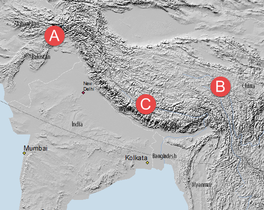
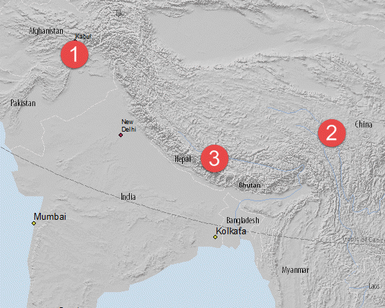
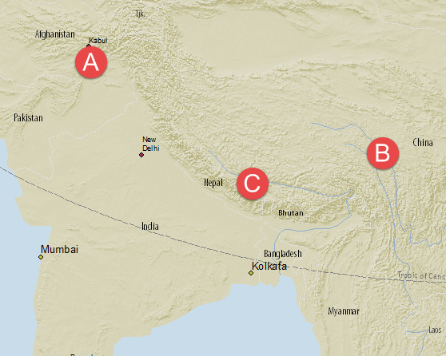

### How to do it
This ESRI document explains which buttons to push in ArcMap- [ArcGIS Help 10.1: Working with Color Ramps](http://resources.arcgis.com/en/help/main/10.1/index.html#//00s600000013000000)

### Why to do it
While their are a vareity of color ramps automatically available in ArcMap, I found that the color range was too broad for the type of thematic map design I have in mind.  For example, frequently type on a map is shown in black, but if the shaded relief color ramp ranges from black-white, the black areas of the shaded relief can obscure the type or visually distract from other data on the map, as shown below.  
   

Notice how the country names of Afghanistan and Pakistan (A) China (B), and Nepal (C), while the steep slopes of the Himalyan Mountains create a dark band of black color (C) which is not an important element to this map.  By changing the color ramp to go from 15% grey to 50% grey, the dark areas of shaded-relief data no longer obscure the black type of the county labels, while the steep slopes of the Himalyan Mountains no longer appear as prominent.  
   

If you are making your final map in color, you may want to consider changing the hue of your color ramp.  Tom Patterson's website [ShadedRelief.com](http://www.shadedrelief.com/) provides a lot of great examples of ways to make more sophisticated color ramps for shaded relief data, but I chose to take a simple approach here.  In my case, the 14-50% grey color ramp made the overall map image dark and dreary, so I decided to change make a new color ramp using a different hue.  I used the [Adobe Kuler](https://kuler.adobe.com/create/color-wheel/) interactive color wheel to pick the starting and ending colors for my color ramp.  I chose a pale yellow-green hue (#54), and then changed the Color Rule to the Shades setting to quickly identify different options for the ends of my color ramp.  After a few tries, I settled on HSB/HSV colors 54,9,89 for my light color, and 54,32,71 for my dark color.

.

